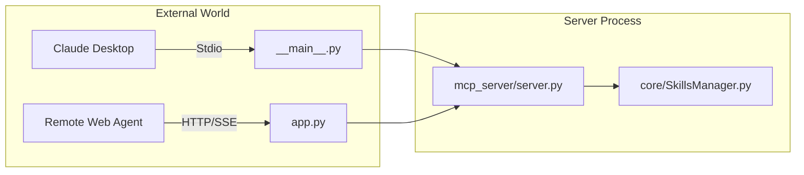

# Deployment & Server Entry Points (`app.py`)

The root `app.py` serves as the unified entry point for deploying the MCP Skills Server. It uses a multi-layered ASGI approach to combine different protocols into a single service.

## 🏗️ Technical Stack
- **FastAPI**: Provides the RESTful API for health checks and skill listing.
- **FastMCP**: Handles the MCP-over-HTTP (SSE) transport.
- **Starlette**: The underlying framework that "mounts" both FastAPI and FastMCP.
- **Uvicorn**: The high-performance production server.

## 📂 Unified Routing

| Endpoint | Protocol | Purpose |
| :--- | :--- | :--- |
| `/mcp/` | MCP-over-HTTP | Primary bridge for remote agents and web-based clients. |
| `/health` | REST (FastAPI) | Health monitoring and server metadata. |
| `/api/skills` | REST (FastAPI) | Lightweight skill discovery for external dashboards. |
| `/docs` | OpenAPI | Interactive Swagger UI for the REST endpoints. |

## 🔄 Startup Sequence

1.  **Pathing**: Injects the current directory into `sys.path` to allow clean relative imports.
2.  **Validation**: Calls `settings.validate()` to ensure local environment safety.
3.  **Registration**: Imports `mcp_server` which triggers all `@mcp.tool` and `@mcp.resource` decorators.
4.  **Lifespan**: Connects the `mcp_asgi.lifespan` to Starlette to ensure background tasks start and stop correctly.

## 🚉 Alternative Transports (`__main__.py`)
For local integrations (like Claude Desktop), the server provides a **Stdio** entry point:
- Command: `python -m mcp_server`
- Function: Directly calls `mcp.run()` which defaults to standard input/output streams.

## 🔄 Deployment Architecture

