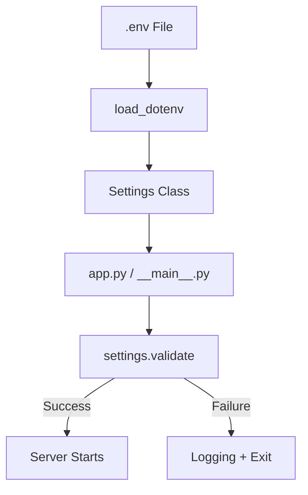

# Settings Management (`settings.py`)

The `settings.py` file centralizes all configuration for the MCP Skills Server, ensuring environment-driven control and startup safety.

## 🛠️ Key Features

### 1. Environment-Driven Configuration
Uses `python-dotenv` to load configurations from a `.env` file. This allows the server to be easily ported between development, staging, and production environments without code changes.

### 2. Startup Validation (`validate`)
A critical production feature that prevents the server from starting in a broken state:
- **Mandatory Keys**: Checks for `GOOGLE_API_KEY`.
- **Directory Presence**: Ensures `SKILLS_DIR` exists.
- **Fail-Fast**: Raises an `EnvironmentError` with a summarized list of missing items if validation fails.

## ⚙️ Configuration Schema

| Setting | Env Var | Default | Description |
| :--- | :--- | :--- | :--- |
| `SKILLS_DIR` | `SKILLS_DIR` | `./skills` | Path to the skills library. |
| `LLM_MODEL` | `LLM_MODEL` | `gemini/gemini-2.5-flash` | The model used for agent logic. |
| `LOG_LEVEL` | `LOG_LEVEL` | `INFO` | Standard Python logging level. |
| `HOST` / `PORT` | `HOST` / `PORT` | `0.0.0.0:8000` | Network binding for the HTTP server. |
| `SCRIPT_TIMEOUT` | `SCRIPT_TIMEOUT` | `60` | Max runtime (sec) for utility scripts. |

## 🔄 Operational Flow

