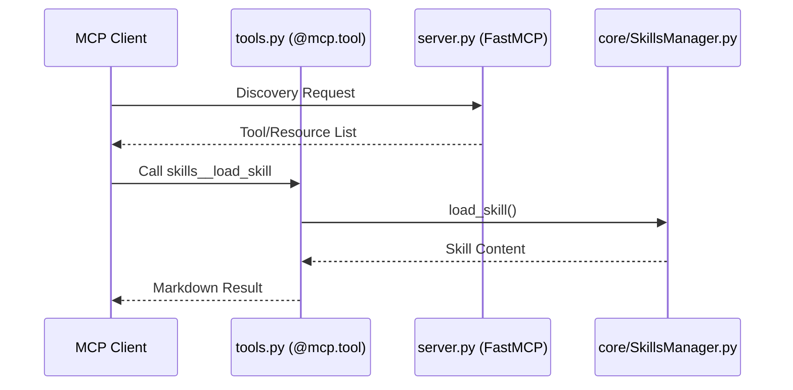

# MCP Layer Architecture (`mcp_server/`)

The `mcp_server/` directory implements the **Standard Model Context Protocol (MCP)** interface. It strictly separates the transport layer from the business logic.

## 📂 Component Roles

### 1. `server.py` (The Factory)
Initializes the `FastMCP` instance.
- **System Instructions**: Defines the "personality" and protocol the Agent must follow (e.g., "Always call `list_skills` first").
- **Central Instance**: Provides the `mcp` decorator object used by tools and resources.

### 2. `tools.py` (The Interface)
Exposes the `SkillsManager` capabilities as discoverable tools.
- **Thin Adapter**: Contains zero business logic. It simply maps MCP tool parameters to `SkillsManager` method calls.
- **Docstrings**: Uses detailed docstrings to provide the Agent with usage context.

### 3. `resources.py` (The Browsable Tree)
Exposes skills as URI-addressable resources available for inspection.
- **`skills://registry`**: Returns a JSON index of all skills.
- **`skill://{skill}/skill.md`**: Direct URI access to internal documentation.
- **Read-Only**: Resources are optimized for client-side caching.

## 🔄 Operational Flow

## 🏗️ Design Principles
- **Transport Agnostic**: The same tool definitions work over Stdio and HTTP.
- **Lazy Registration**: Tools and resources are imported in `__init__.py` to ensure they register on the `mcp` instance before the server starts.
